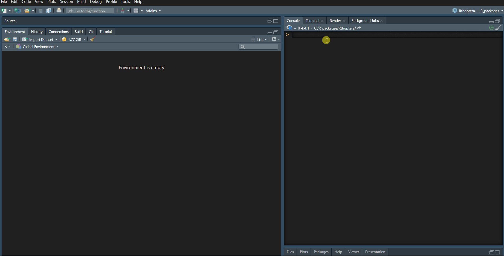

```{r setup, include=FALSE}
knitr::opts_chunk$set(echo = TRUE, 
                      eval = FALSE)
```


## How to launch an app </a>


In *Rthoptera*, most of the relevant functions come with a Shiny app companion. NOTE: If no Wave objects are found in the R environment (i.e., you haven't imported any yet), only the *import_wave* app will work. To explore which apps are available, run:
```{r}
library(Rthoptera)
launch_app()
```
The `launch_app()` function supports partial matching, which means that, for example, if you want to run the *import_wave* app, you can just type:
```{r}
launch_app("import")
```
and `Rthoptera` will launch the *import_wave* app. However, some apps have longer and similar names, for which you will need to type more characters. For example, if you run:
```{r}
launch_app("song_stats")
```
`Rthoptera` will ask you to specify further. If you pay attention to the list of available apps, you will notice that the 'song_stats' apps are the only ones ending with 'hq' and 'lq', so if you run:
```{r}
launch_app('hq')
```
*Rthoptera* will understand you are trying to do *launch_app("temporal_stats_hq")*. 

<br>
How to use the *launch_app()* command:
 

