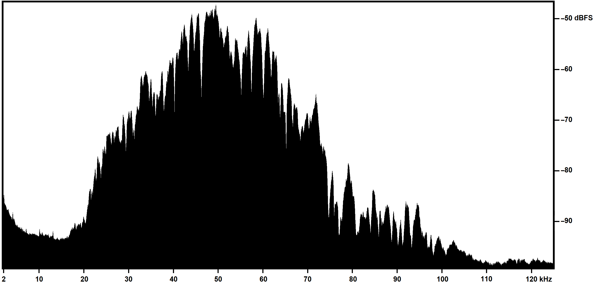
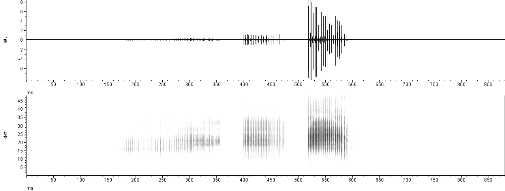
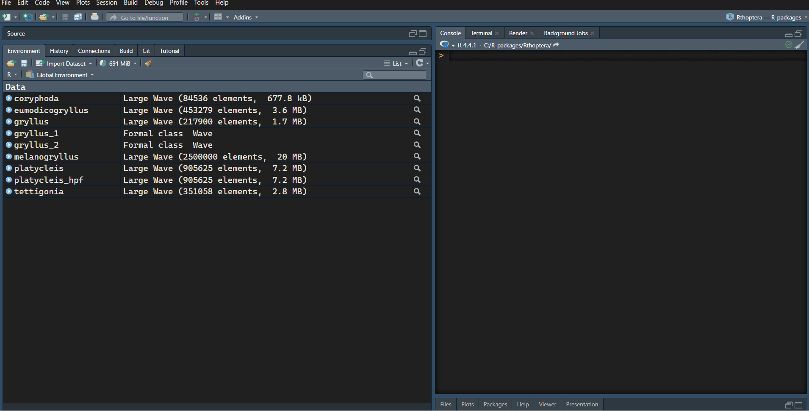
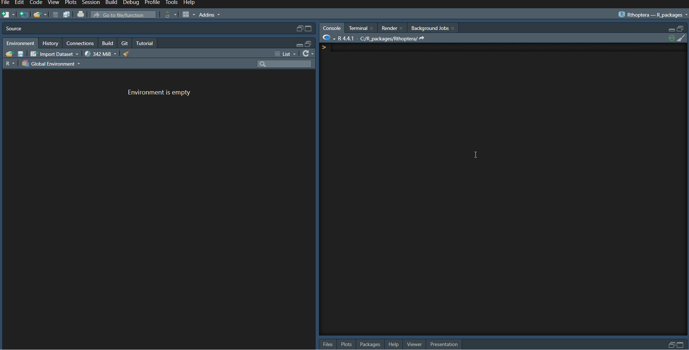
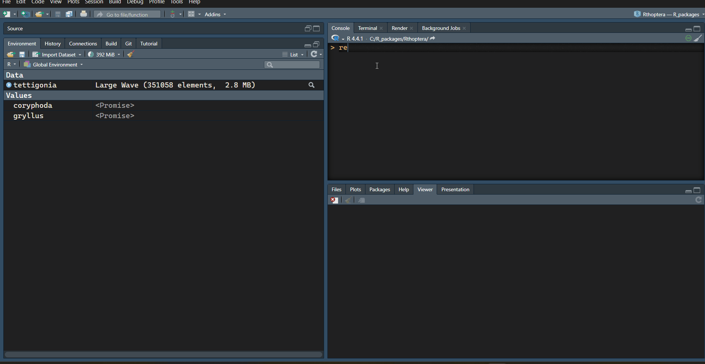
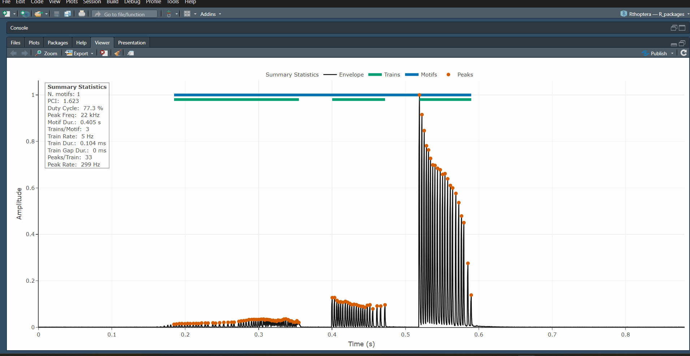
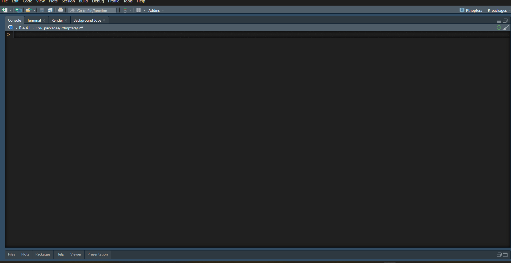
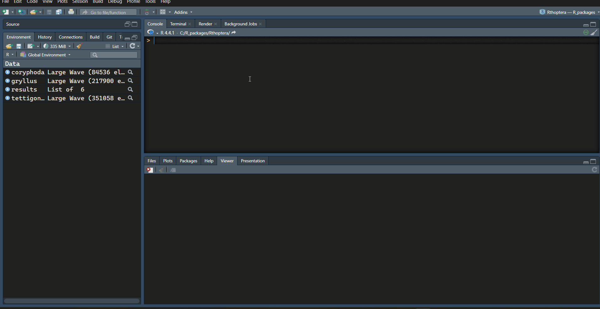

```{r setup, include=FALSE}
knitr::opts_chunk$set(echo = TRUE)
```

## Multi-software "manual" approaches

Before the development of *Rthoptera*, being dissatisfied with the image output provided by the available bioacoustics software packages, the authors used screenshots from the relevant views obtained by closed-source software, mostly Adobe Audition (Adobe Inc., 2023).

Obviously, not being conceived for such usage, the screenshots need extensive manual refinements, that require the coordinated use of other closed-source software, that usually include MS-Paint and Adobe Photoshop.
After the selection of the relevant portion of the audio file, the bare minimum of activities needed includes:

-   Taking a screenshot (i.e., copying current screen content in the RAM image clipboard);

-   Pasting the screenshot in the image editing environment;

-   Improving image clarity by adjusting image levels (e.g., brightness, contrast, sharpness, etc.).
    Other post-production interventions needed may include image mode conversion (color to black & white or vice-versa) and feature (e.g., grid lines) removal;

-   Adding readable vertical and horizontal axes, including tick marks, values and labels: even though the original screenshot may include such information, the on-screen font size is usually too small to be readable.
    Furthermore, if a non-initial section of the audio file is illustrated, the on-screen horizontal time scale does not start with zero, which complicates its reading.
    For those reasons, suitably sized and zeroed horizontal and vertical scales need to be juxtaposed to the image, in a time-consuming process.
    Usually, under Windows operating system, this activity is performed with MS-Paint.
    On average, obtaining each image may require from 10 to 20 minutes of work (e.g., as in Brizio et al., 2021).
    The raster images emerging from the process described are sufficiently clear, but there are drawbacks, including:

-   Image content is limited to the views available in the audio analysis software: usually, this boils down to time/pressure envelopes, spectrograms and mean spectra;

-   Composite images (e.g. time/pressure envelopes at different time scales, or combination of mean spectra and spectrogram) cannot be obtained in a single step, and require a mosaic of separately generated images;

-   Images do not include any data besides those appearing in the image itself.
    If further data are needed for the purpose of the publication, they must be obtained in other ways, typically by manual transcription of values read on screen, often obtained by suitably positioning the mouse pointer, e.g. in the case of the reading of pressure levels from mean spectra (not forgetting that the pixel-wise process of pointer positioning is inconsistent and error-prone);

-   Image style (e.g., color coding of pressure levels) may vary from one image to another, depending on the software used for screenshot generation.

The whole process described above is highly dependent from the skill, the experience and the individual sensitivity of each operator, and consistency of the results by different operators is not fully granted.

This is an example of a Mean Power Spectrum extracted from a screenshot from Adobe Audition and post-processed in Microsoft Paint and Adobe Photoshop to change the color scale and add new axes labels, requiring about 10 minutes to produce:



<br> Below is the same plot type produced by *Rthoptera* (using normalized amplitude instead of dB FS), which took 45 seconds to produce, including the selection of the file, changing scale parameters and custom labels on the Y-axis, modifying the output dimensions, and typing down the species name and call type.


### Raven Pro 1.6

NOTE: For this comparison we used a machine with Windows 11 Home, 64 bit, 16 GB RAM.

**Raven Pro 1.6** (Cornell Lab of Ornithology, 2021) is a dedicated bioacoustics software build by and for scientists.
Even the free version **Raven Lite** offers a suite of useful tools for acoustic analysis, and is extensively used by researchers in acoustic communication of birds, anurans, bats, and other mammals.
One disadvantage of this software is its proprietary nature, limiting the user's ability to customize the plots and forcing them to rely on extra software to obtain the desired results.
The plot shown below took about 70 seconds to make in **Raven Pro 1.6**, including un-checking the position marker (which is wrongly shown in many scientific publications), adjusting the zoom level on the oscillogram, the window size and contrast for the spectrogram, and finally changing to grey scale in Microsoft Office, which does not allow to control the output dimensions either:



<br> 
While the output is nice, it is far from customizable, and the user can't control the output parameters either (e.g., image dimensions).
To our knowledge, all the plots in **Raven** are separate views, not allowing to add a Mean Power Spectrum aligned on the side of the spectrogram.
If we wanted to achieve the same output as in the "multi-plot" from *Rthoptera*, we would have to manually paste the spectral plot on the side, requiring a manual adjustment of the dimensions which would likely distort the axes labels.
If we consider iterating this process over many recordings, it translates into a very tedious endeavor.

In *Rthoptera*, the final output can be obtained in about 10 seconds without these extra manual processing.
First, we will load some Waves from the *RthopteraSounds* package:

```{r, eval=FALSE}
library(Rthoptera)

# Load the sample recordings
library(RthopteraSounds)
data("coryphoda") 
data("tettigonia")
data("gryllus")
```

Then, we launch the app `multi_plot` app with the following call:

```{r, eval=FALSE}
launch_app("multi_plot")
```

<br> Here we can modify some parameters before computing the plot:



<br>
This is the exported image:


<br> 
Note that in **R**, the **warbleR** package also allows to extract spectral statistics automatically, but it requires importing selection tables from **Raven**, which makes the process longer.

## <b>Rthoptera</b>'s Interactive Plots

One of the main features of our package is interactivity.
Several functions and apps produce interactive plots that can be saved as HTML documents for end users to explore.
Here are some examples on how to obtain interactive plots using the `tettigonia` Wave object from *RthopteraSounds*:

First, let's make an interactive oscillogram with the *oscillogram_plotly* function:
```{r, eval=FALSE}
data("tettigonia")
# Interactive oscillogram (aka waveform)
oscillogram_plotly(tettigonia)
```



<br>

An ancillary interactive spectrogram can be obtained with the *spectrogram_plotly()* function. Note that the interactive spectrogram was added mainly as an aid during preprocessing (band-pass filtering) and is not intended for illustrating a signal in a professional way (hence the blueprint style):

```{r, eval=FALSE}
# Interactive spectrogram (aka sonogram)
spectrogram_plotly(tettigonia)
```


<br>
An interactive Power Spectrum can be obtained with the *spectrum_plotly()* function. This plot shows a black linear scale spectrum on top of a grey dB scale spectrum:

```{r, eval=FALSE}
# Interactive mean power spectrum (aka PSD)
spectrum_plotly(tettigonia)$plot
```

<br>

 

<br>

## <b>Rthoptera</b>'s Temporal Metrics

While all the importing and preprocessing apps were added here just to make your life easier, the core of *Rthoptera*'s contribution to insect biacoustics is the automatic detection and characterization of temporal units.
By playing around with a few parameters, you can specify what to measure, and *Rthoptera* will do the rest.
Most of the available tools for automatic measurement of acoustic signals are based on a simple amplitude threshold which will separate a signal from background noise.
That approach is enough to measure most high-SNR recordings of tonal calls, such as those produced by most ground-, tree-, and field-crickets.
However, when you want to measure broadband stridulations such as those produced by most katydids and bush-crickets, there are other things to consider.
These broadband calls are characterized by transient-like "clicks", often reflecting individual impacts of the stridulatory teeth on the scraper.
In our neutral nomenclature, we call these sounds 'peaks'.
Researchers are often interested in measuring the number of peaks in each 'pulse' (i.e., a continuous train of waves) or, as we call it, 'train'.
The problem arises when some of these peaks are too faint to measure with the threshold approach, falling below the threshold if we want to filter out the reverberations of the signal.
*Rthoptera* solves this by detecting local peaks with user-defined parameters.
The *call_stats_lq()* function creates the following outputs:

• An interactive plot showing individual peaks, trains, and motifs, as well as reporting summary statistics of the main measurements.

• A tabular dataset including: peak, train, and motif measurements, a summary table and another table with all the parameters used in the analysis.
All the temporal measurements are based on the peak detections.

You can use Plotly's tools to zoom-in and explore the peak detections, especially in the fainter train.
Note that the 'Summary Statistics' panel can be toggled off by clicking on the text in the legend.
For each train detection, spectral statistics are calculated.
This can be accessed in the train_data table:

```{r , eval=FALSE}
# Using a low detection threshold
results <- call_stats_lq(coryphoda, 
                         specimen_id = "coralb_001",
                         detection_threshold = 0.01,
                         motif_seq = FALSE)
# Show the plot
results$plot
```


 

<br>

You can download interactive plots using the "Export" menu in the Rstudio viewer pane:





<br> 

Now let's inspect the results in the output tables:

```{r, eval=FALSE}
# Summary
View(results$summary_data)

# Peaks
View(results$peak_data)

# Trains
View(results$train_data)

# Motifs
View(results$motif_data)

# Parameters used
View(results$params)
```

<br>



<br> 

The *Coryphoda* analysis is a perfect illustration for the Temporal and Dynamic Excursion metrics in the `call_stats_lq()` function.
If we used an amplitude threshold approach, we would likely have to ignore the first train, which is produced when the male opens its tegmina (forewings).
However, the peak detection approach allows us to capture this faint sound which is packed with information.
Let's focus on the "train_data" table:

```{r, echo=FALSE, message=FALSE, warning=FALSE}
library(Rthoptera)
library(RthopteraSounds)
data("coryphoda")
results <- call_stats_lq(coryphoda, 
                         detection_threshold = 0.01, 
                         motif_seq = FALSE)
knitr::kable(results$train_data, caption = "Fig. 12. Train Data table from the 'results' object.") 
```

```{css, echo=FALSE}

table {
  caption-side: bottom;
}

table caption {
  font-size: 12px; 
  color: black; 
}
```


Note how the Temporal Excursion ("tem.exc" column) is much higher in the first train, which is also the longest ("train.dur" column), with the highest number of peaks ("n.peaks" column), the faintest ("mean.amp" column), and the flattest in terms of energy, with the lowest Dynamic Excursion ("dyn.exc" column).
The opposite is true in almost all metrics for the last train (closing stroke); it is the shortest, with the lowest number of peaks, the loudest, with the greatest change in amplitude (Dynamic Excursion).

If you want to analyze tonal, "high-Q" songs, such as those produced by most crickets, you should instead use the `call_stats_hq()` function.
In this example, we will use the *gryllus* Wave from *RthopteraSounds.* We will also add another level of aggregation by leaving *motif_seq = TRUE* (Default) in the arguments:

```{r , eval=FALSE}
# Use the call_stats_lq() function with a low detection threshold
call_stats_hq(gryllus, 
              specimen_id = "gryllus_001") #optional

# Show the plot
results$plot
```



<br>

## Conclusions
*Rthoptera* is capable of improving the efficiency and effectiveness of the analysis of insect signals:

-   by granting a more objective approach: the user chooses the parameter values, and the image plus data tables generation is entirely and consistently managed by *Rthoptera*, excluding the vagaries of a lengthy manual process and the impact of different operators habits or manual skills;

-   by granting an advantage in terms of time required for image generation: even though R and RStudio are not especially suited for bioacoustic analyses, the worst-case scenario observed during the tests (up to 100 seconds for the generation of a composite image with *Rthoptera*) compares very favorably with the 20 or 30 minutes required to obtain a comparable image by the screenshot-based process illustrated above;

-   by generating the publication-ready plots, including composite illustrations (i.e., "multiplot") that would be more tedious and time-consuming to generate with a multi-software approach.

-   by simultaneously producing multiple tabular datasets with diverse levels of aggregation;

-   by providing new metrics (Pattern Complexity, Broadband Activity, Temporal Excursion, Dynamic Excursion, etc.) that may set a standard for future investigations.

<br><br><br>

### References

Adobe Inc. (2023).
Adobe Audition (Version 23.0) [Computer software].
Adobe.
<https://www.adobe.com/products/audition.html>

Brizio, C.; Buzzetti, F.M.; Pavan, G. Beyond the audible: Wide band (0-125 kHz) field investigation on Italian Orthoptera (Insecta) songs.
*Biodivers. J.* 2020, 11, 443–496.
<https://doi.org/10.31396/Biodiv.Jour.2020.11.2.443.496>.

Cornell Lab of Ornithology.
(2021).
Raven Pro: Interactive sound analysis software (Version 1.6) [Computer software].
<https://ravensoundsoftware.com/>

<br><br>
