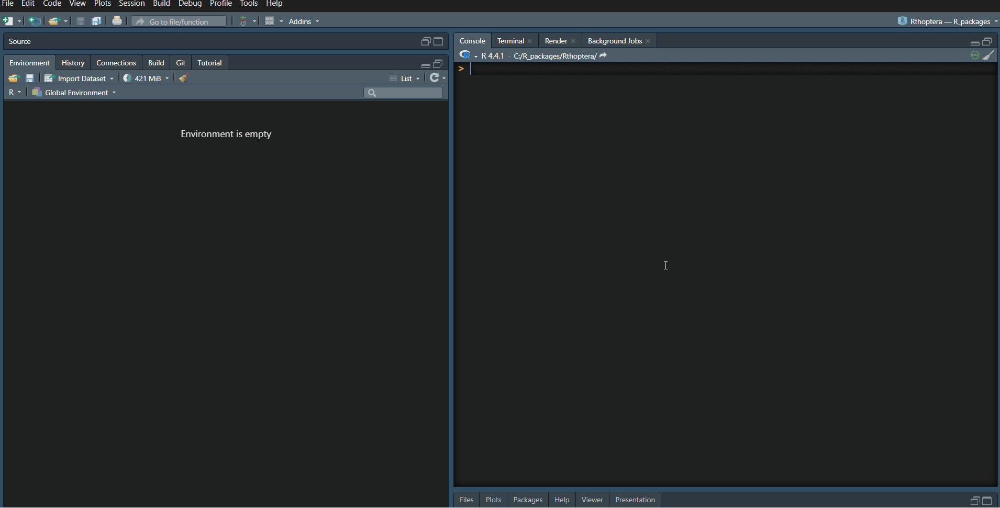

```{r setup, include=FALSE}
knitr::opts_chunk$set(echo = TRUE)
```

## Getting summary data for specific trains across motifs

When you use the `song_stats` functions to extract temporal and spectral statistics, the summary output does not include summaries by individual "train ids" because the number of train per motif is variable between species. However, you can easily summarize these with little code:

For this example, we will work with the `gryllus` object from the `RthopteraSounds` package. After loading the data, we will run the `song_stats_hq` function which is optimized for tonal calls, storing the output of the function in the local environment:
```{r, evaluate = FALSE, message=FALSE, warning=FALSE}
# Load packages and data
library(Rthoptera)
library(RthopteraSounds)
data(gryllus)

# Store the results in the R environment
results <- song_stats_hq(gryllus)
```

Next, we will group the train data by "train.id", and summarize it with the `reframe()` function from the **dplyr** package, calculating its mean:
```{r, eval=FALSE, message=FALSE, warning=FALSE}
results$train_data |> 
  group_by(train.id) |> # group the trains by their identity within a motif
  reframe(mean(peak.freq)) # get the mean per "train.id" 
```



